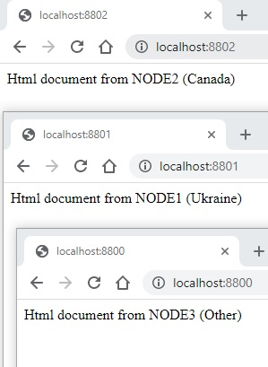

# Run #  
```
docker-compose -f "docker-compose.yml" up -d --build  
```

------------

# Geo DNS work  
  
port 8001 - have Ukrainian ip  
port 8002 - have Canadian ip  
port 8000 - have another country  ip  

# Stats  
Important: at the time of testing cache = off.  
```
siege -c30 -t60S http://localhost:8801/image.jpg  
```
```
                              least_conn        | round-robin      | ip_hash          | weight           | only one node    |
Transactions:                   3419 hits       | 3345 hits        | 3447 hits        | 3544 hits        | 3458 hits        |
Availability:                 100.00 %          | 100.00 %         | 100.00 %         | 100.00 %         | 100.00 %         |
Elapsed time:                  59.77 secs       | 59.79 secs       | 59.57 secs       | 59.61 secs       | 59.97 secs       |
Data transferred:              36.45 MB         | 35.66 MB         | 36.75 MB         | 37.39 MB         | 36.87 MB         |
Response time:                  0.01 secs       | 0.01 secs        | 0.01 secs        | 0.01 secs        | 0.01 secs        |
Transaction rate:              57.20 trans/sec  | 55.94 trans/sec  | 57.86 trans/sec  | 59.46 trans/sec  | 57.66 trans/sec  |
Throughput:                     0.61 MB/sec     | 0.60 MB/sec      | 0.62 MB/sec      | 0.63 MB/sec      | 0.61 MB/sec      |
Concurrency:                    0.55            | 0.74             | 0.51             | 0.46             | 0.46             |
Successful transactions:        3419            | 3345             | 3447             | 3544             | 0.61             |
Failed transactions:               0            | 0                | 0                | 0                | 0                |
Longest transaction:            0.07            | 0.06             | 0.07             | 0.12             | 0.06             |
Shortest transaction:           0.00            | 0.00             | 0.00             | 0.00             | 0.00             |
```
